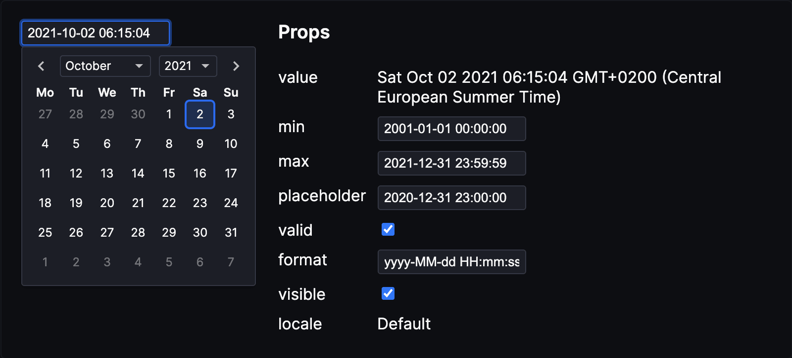

# Date Picker Svelte

Date and time picker for Svelte

Supports theming, custom formats, internationalization and autopunctuation (e.g typing "20201111111111" gives you "2020-11-11 11:11:11" with the default format)


[](LICENSE)
[](https://npmjs.com/package/date-picker-svelte)
[](https://npmjs.com/package/date-picker-svelte)

[Demo](https://date-picker-svelte.kasper.space/demo)

[Documentation](https://date-picker-svelte.kasper.space/docs)



## Install

```
npm install date-picker-svelte
```

## Usage

```svelte
<script>
  import { DateInput } from 'date-picker-svelte'
  let date = new Date()
</script>

<DateInput bind:value={date} />
```

Check the [docs](https://date-picker-svelte.kasper.space/docs) to learn more

## Dev instructions

### Get started

1. Install Node.js (v14 works)
2. Run `npm install`

### Commands

- `npm run dev`: Start site in dev mode
- `npm run build`: Build package and site
- `npm run build:package`: Build package
- `npm run build:site`: Build site
- `npm run preview`: Preview production site
- `npm run check`: Run `svelte-check`
- `npm run lint`: Lint

### Publish new version

1. Update `CHANGELOG.md`
2. Check for errors
    ```
    npm run check
    ```
3. Bump the version number
    ```
    npm version --no-git-tag <version>
    ```
4. Generate the package
    ```
    npm run build:package
    ```
5. Publish the package
    ```
    npm publish ./package
    ```
6. Commit with a tag in format "v#.#.#"
7. Create GitHub release with release notes
